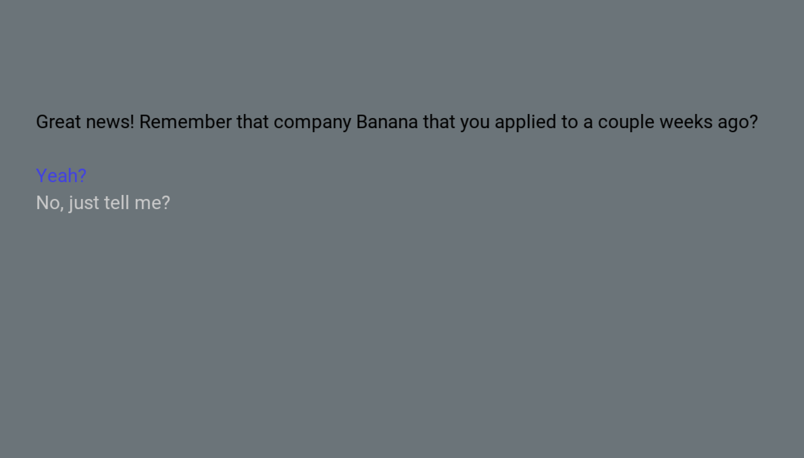

# Interview Simulator!

Author: Emma Liu

Design: It's interview season! Graduation is fast approaching and you need a sick SWE gig! But luckily, you've got the opportunity of a lifetime - you've made it to the final round of interviews! Take your technical skills to the test with a variety of tricky questions.

(DISCLAIMER: Any persons/likeness in this fictional scenario is purely fictional and not based off of any personal experience!)

Text Drawing:

The text drawing uses HarfBuzz to shape the text according to the font, and then uses FreeType to render. For each font, I store a map between glyphs and useful information to render each character. When new glyphs are seen for a given font, they are saved for faster lookup next time. This enables on-demand dynamic text rendering during the game, based on the player's actions. 

As for where the text originates, in the game constructor, I invoke a parsing routine
that interprets script.txt, which contains information about phase and option states, 
and store them in an immediate and accessible buffer of chars.
This enables me to link paths chosen through selecting options. 
The text for a phase is created when it is loaded.

Screen Shot:

How To Play:

At each phase, you will be able to make a choice from a set of available options. Use your UP and DOWN keys to toggle between the sets; your tentative choice will be marked in blue. Press ENTER to make your selection and progress in the scene.

Sources: I used the Courier New and Roboto Regular fonts, obtained from [Font Squirrel](https://www.fontsquirrel.com/).

This game was built with [NEST](NEST.md).

